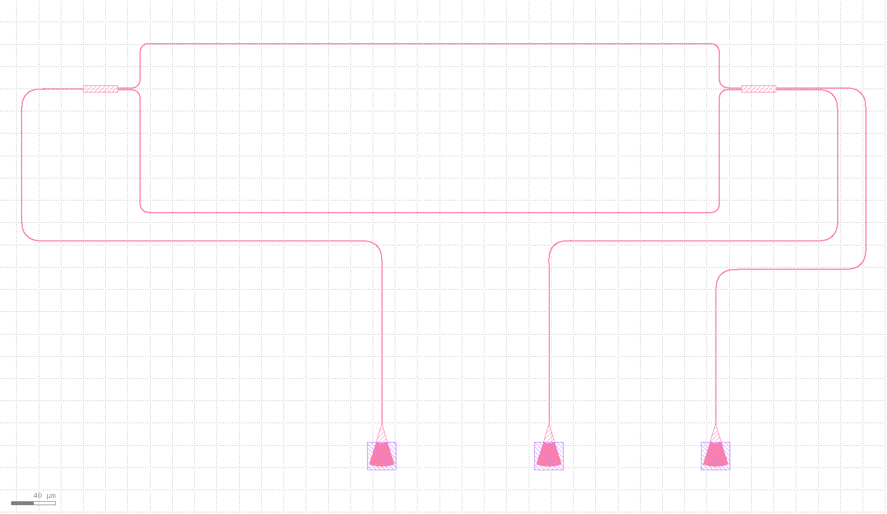
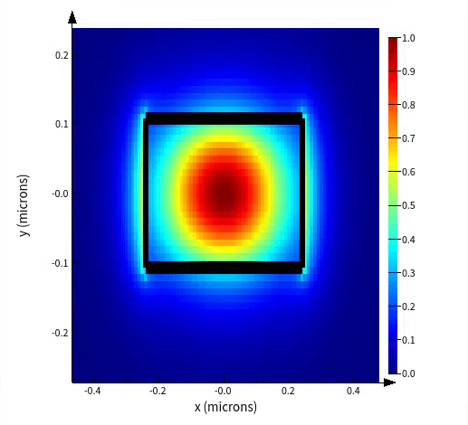
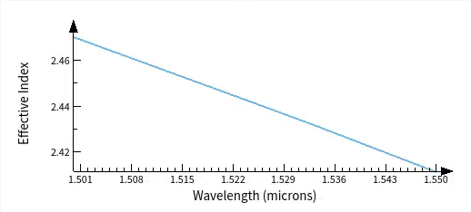
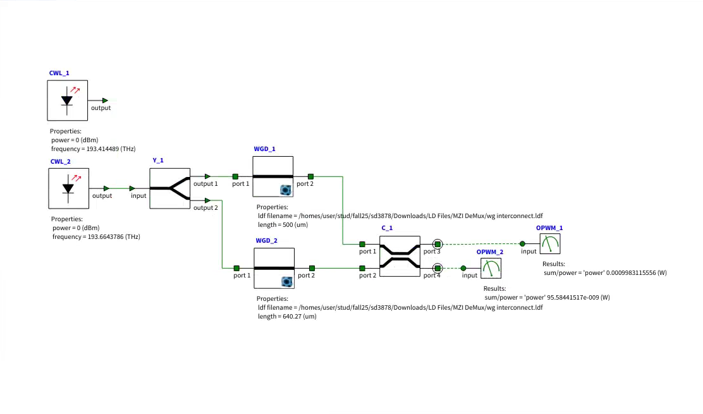
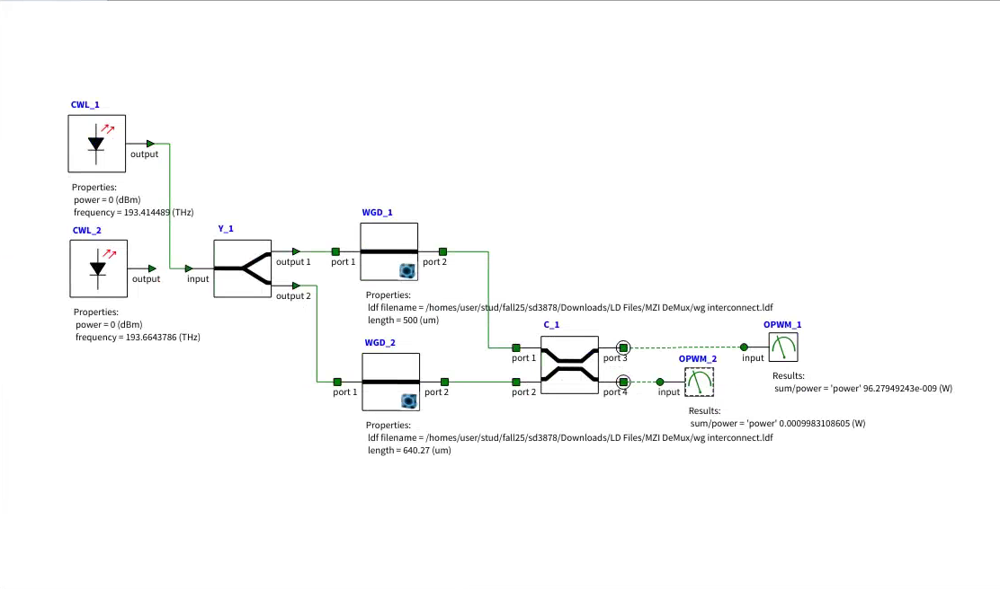

# MZI Wavelength Demultiplexer

This project demonstrates a silicon Mach–Zehnder interferometer (MZI) designed to separate two closely spaced optical wavelengths. The device routes **1548 nm to the upper output** and **1550 nm to the lower output**.

The waveguide was characterized using Ansys Lumerical MODE/FDE, then the dispersive model was imported into Lumerical INTERCONNECT, and the physical layout was generated with GDSFactory and inspected in KLayout. The KLayout output is displayed below.



## Device Overview

The simulated circuit contains:

- A 1×2 splitter that divides the input power between two arms
- Two MODE waveguide elements with different physical lengths
- A 2×2 output coupler that recombines the optical fields
- Two complementary output ports

The unequal arm lengths create a wavelength-dependent phase difference. This causes 1548 nm and 1550 nm to interfere constructively at opposite output ports.

## Design Parameters

| Parameter | Value |
|---|---:|
| Platform | Silicon-on-insulator (SOI) |
| Waveguide width | 500 nm |
| Waveguide height | 220 nm |
| Simulated mode | Fundamental TE mode (TE0) |
| Approximate group index at 1550 nm | 4.28 |
| Short-arm length in INTERCONNECT | 500 µm |
| Long-arm length in INTERCONNECT | 640.27 µm |
| Arm-length difference | 140.27 µm |
| Input wavelengths | 1548 nm and 1550 nm |
| CW input power per test | 0 dBm (1 mW) |

## Simulation Workflow

1. Create a 500 nm × 220 nm silicon waveguide in Lumerical MODE.
2. Solve for the fundamental TE mode.
3. Run a frequency sweep to obtain the wavelength-dependent effective index and group velocity.
4. Export the dispersive waveguide model as an LDF file.
5. Import the LDF model into two MODE Waveguide elements in INTERCONNECT.
6. Construct the MZI using a 1×2 input splitter and a 2×2 output coupler.
7. Set the waveguide lengths to 500 µm and 640.27 µm.
8. Run separate 0 dBm CW tests at 1548 nm and 1550 nm.
9. Measure both output powers using optical power meters.

## Simulation Results

| Wavelength | Upper output | Lower output | Selected port | Extinction ratio |
|---|---:|---:|---|---:|
| 1548 nm | 0.998312 mW (-0.0073 dBm) | 0.0000956 mW (-40.1961 dBm) | Upper | 40.19 dB |
| 1550 nm | 0.0000963 mW (-40.1647 dBm) | 0.998311 mW (-0.0073 dBm) | Lower | 40.16 dB |

For either wavelength, the summed output power is approximately **0.998407 mW** for a **1 mW input**. This corresponds to:
- Power transmission: **99.84%**
- Simulated insertion loss: **0.0069 dB**
- Extinction ratio: approximately **40 dB**

The small difference between the input and total output power is caused by modeled component losses and numerical precision.

## MODE Results

| Fundamental TE Mode | Frequency Sweep |
|---|---|
|  |  |

## INTERCONNECT Results

| 1548 nm Test | 1550 nm Test |
|---|---|
|  |  |

## Generate the GDS Layout

Install the required Python packages:

```bash
python -m pip install gdsfactory matplotlib
```

Run the layout script from the `mzi` directory:

```bash
python mzi_demux_layout.py
```

The script generates `mzi_demux_layout.gds`, which can be opened and inspected in KLayout.

## Notes and Limitations

- The layout uses GDSFactory’s generic PDK and is not fabrication-ready.
- The MMI and grating couplers require electromagnetic simulation and adaptation to a foundry PDK before fabrication.
- The circuit results use MODE-derived waveguide data and compact or idealized INTERCONNECT components.
- Foundry design-rule checks, fabrication-tolerance analysis, bend-loss verification, and experimental measurements are outside the current scope.

## Tools

- Ansys Lumerical MODE
- Ansys Lumerical INTERCONNECT
- GDSFactory
- KLayout
- Python

## Author

Shroyon Dasgupta
