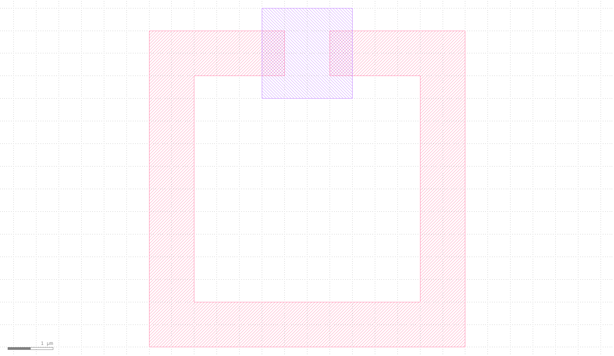

# Split-Ring Resonator (SRR) with NbOI2 Flake
A parametric square split-ring resonator with a dielectric flake
bridging the ring's split gap. Supplements a COMSOL simulation of a
gold SRR + NbOI2 flake device.


The GDS file srr_with_flake.gds is also uploaded.

## Design
- The ring is formed as a boolean subtraction of two concentric squares
- A gap is cut through the top wall via a second boolean subtraction, 
converting the closed ring into a split-ring resonator.
- The flake sits on a **separate GDS layer** (distinct material, e.g. NbOI2) 
directly over the gap. It is not merged with the ring layer.

## Parameters
| Parameter | Description | Default |
|---|---|---|
| `srr_length` | Side length of the square SRR (um) | 7.0 |
| `srr_arm_width` | Wall/arm width of the SRR (um) | 1.0 |
| `srr_gap` | Width of the air gap (um) | 1.0 |
| `flake_size` | Side length of the square flake (um) | 2.0 |
| `srr_layer` | GDS layer for the SRR | (1, 0) |
| `flake_layer` | GDS layer for the flake | (2, 0) |

## Design rule check (DRC)
`srr_with_flake` validates its inputs via `srr_drc` before generating
any geometry, raising a `ValueError` listing every violation found:

- Minimum feature size of 0.5 um for `srr_length`, `srr_arm_width`,
  `srr_gap`, and `flake_size`.
- `srr_arm_width` must be less than a quarter of `srr_length`.
- `srr_gap` must be less than a quarter of `srr_length`.
- `flake_size` must be smaller than the inner square length
  (`srr_length - 2 * srr_arm_width`), so the flake fits within the
  ring's inner opening.
- `srr_layer` and `flake_layer` must be distinct.

This is a lightweight sanity check, not a substitute for a full DRC deck 
as it only catches basic dimensional errors before a GDS is generated.

## Usage
```bash
pip install -r requirements.txt
python srr_with_flake.py
```

This writes `srr_with_flake.gds` and opens a preview plot.

Or import the parametric cell directly:

```python
from srr_with_flake import srr_with_flake

c = srr_with_flake(srr_length=10.0, srr_gap=0.3)
c.write_gds("my_srr.gds")
```

## Fabrication notes
- Layer numbers (`(1,0)`, `(2,0)`) are placeholders — replace with
  your process's actual ring-metal and flake-material layers before
  sending to fab.
- Verified in KLayout: gap cut and flake placement checked visually
  against target dimensions.
